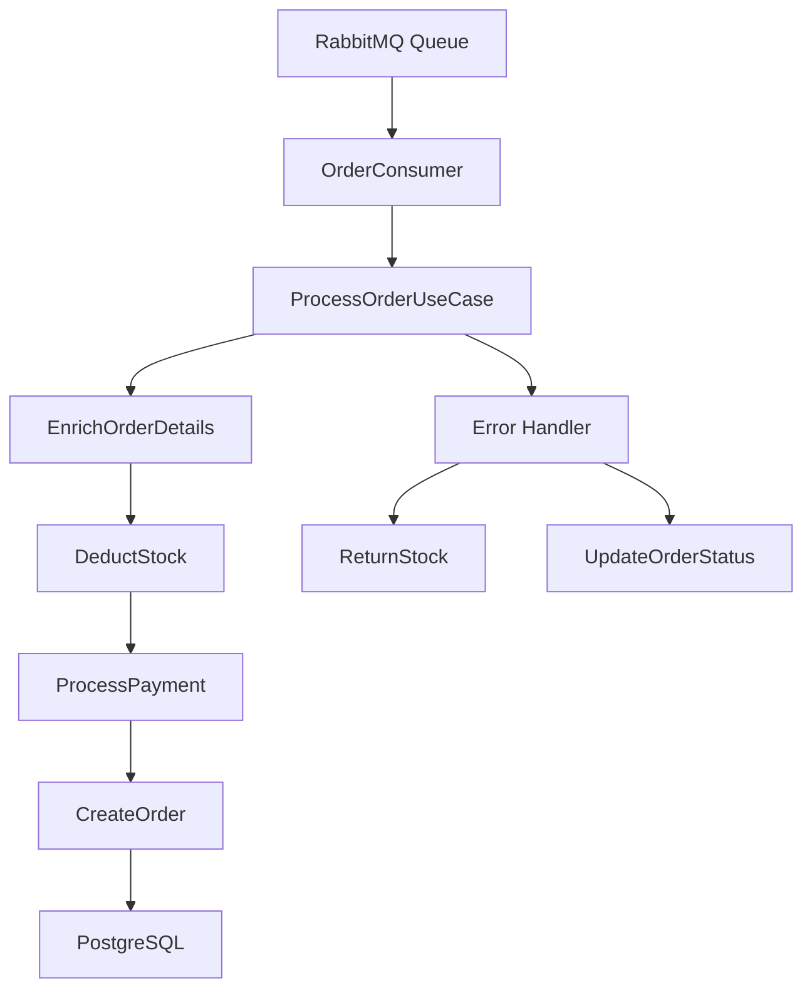

# FIAP Pedido Service

Serviço de processamento de pedidos que consome mensagens do RabbitMQ e orquestra a validação, enriquecimento e processamento de pedidos através de múltiplos microserviços.

---

## 🚀 Tecnologias

- **Java 24**
- **Spring Boot 3.5.4**
- **PostgreSQL** (banco de dados)
- **RabbitMQ** (message broker - consumer)
- **Spring WebClient** (comunicação entre serviços)
- **Flyway** (migrações SQL)
- **MapStruct** (mapeamento de objetos)
- **Lombok** (redução de boilerplate)
- **JaCoCo** (cobertura de testes)
- **Docker & Docker Compose**
- **Arquitetura Limpa (Clean Architecture)**

---

## 🏗️ Arquitetura

O projeto segue os princípios da **Clean Architecture** e atua como um **orquestrador** de processos de negócio:

```
├── Consumer (RabbitMQ Message Consumer)
├── UseCase (Orquestração e Regras de Negócio)
├── Gateway (Interfaces de Comunicação)
│   ├── Database (Persistência de Pedidos)
│   └── WebClient (Comunicação com Microserviços)
└── Domain (Entidades de Negócio)
```

### Fluxo de Processamento

1. **Recebimento**: Consome mensagens de pedidos da fila RabbitMQ
2. **Validação**: Valida dados do cliente via Cliente Service
3. **Enriquecimento**: Busca detalhes dos produtos via Produto Service
4. **Estoque**: Deduz estoque via Estoque Service
5. **Pagamento**: Processa pagamento via Pagamento Service
6. **Persistência**: Salva pedido processado no banco de dados
7. **Compensação**: Reverte operações em caso de erro

---

## 📦 Estrutura do Projeto

```
src/
├── main/java/com/fiap/pedido/
│   ├── consumer/          # Consumer RabbitMQ
│   ├── usecase/           # Casos de uso de orquestração
│   │   ├── load/          # Carregamento de dados
│   │   └── validation/    # Validações de negócio
│   ├── gateway/           # Interfaces de comunicação
│   │   ├── database/      # Implementação banco de dados
│   │   └── web/           # WebClients para microserviços
│   ├── domain/            # Entidades de domínio
│   ├── mapper/            # Mapeamento MapStruct
│   ├── configuration/     # Configurações Spring
│   └── exception/         # Exceções customizadas
└── test/                  # Testes unitários e integração
```

---

## 🔄 Integração com Microserviços

O serviço se comunica com os seguintes microserviços:

| Serviço | Porta | Finalidade |
|---------|-------|------------|
| **Cliente Service** | 8080 | Validação de dados do cliente |
| **Produto Service** | 8081 | Busca detalhes dos produtos por SKU |
| **Estoque Service** | 8082 | Baixa e reversão de estoque |
| **Pagamento Service** | 8083 | Processamento de pagamentos |

---

## 📡 Message Consumer

### Fila RabbitMQ
- **Queue**: `order-queue`
- **Durable**: `true`
- **Exchange**: Direct (padrão)

### Formato da Mensagem
```json
{
  "orderId": "d87866f9-9f1f-4acc-a800-619a445e697c",
  "customerId": "123e4567-e89b-12d3-a456-426614174000",
  "cardNumber": "1234567890123456",
  "status": "ABERTO",
  "items": [
    {
      "sku": "SKU123",
      "quantity": 2
    }
  ]
}
```

---

## 🗄️ Modelo de Dados

### Order (Pedido)
- `orderId` (UUID): Identificador único
- `customerId` (UUID): ID do cliente
- `cardNumber` (String): Número do cartão
- `status` (OrderStatus): Status do pedido
- `paymentStatus` (PaymentStatus): Status do pagamento
- `items` (List<Item>): Itens do pedido

### OrderStatus
- `ABERTO`: Pedido recebido
- `CONFIRMADO`: Pedido processado com sucesso
- `CANCELADO`: Pedido cancelado por erro

### PaymentStatus
- `PENDENTE`: Pagamento aguardando processamento
- `APROVADO`: Pagamento aprovado
- `REJEITADO`: Pagamento rejeitado

---

## ⚙️ Configuração

### Variáveis de Ambiente

| Variável | Padrão | Descrição |
|----------|--------|-----------|
| `SERVER_PORT` | `8084` | Porta da aplicação |
| `RABBITMQ_HOST` | `localhost` | Host do RabbitMQ |
| `RABBITMQ_PORT` | `5672` | Porta do RabbitMQ |
| `RABBITMQ_USERNAME` | `guest` | Usuário RabbitMQ |
| `RABBITMQ_PASSWORD` | `guest` | Senha RabbitMQ |
| `RABBITMQ_QUEUE_NAME` | `order-queue` | Nome da fila |
| `SPRING_DATASOURCE_URL` | `jdbc:postgresql://localhost:5435/orderdb` | URL do banco |
| `SPRING_DATASOURCE_USERNAME` | `postgres` | Usuário do banco |
| `SPRING_DATASOURCE_PASSWORD` | `postgres` | Senha do banco |
| `FIAP_CLIENTE_SERVICE_URL` | `http://localhost:8080` | URL Cliente Service |
| `FIAP_PRODUTO_SERVICE_URL` | `http://localhost:8081` | URL Produto Service |
| `FIAP_ESTOQUE_SERVICE_URL` | `http://localhost:8082` | URL Estoque Service |
| `FIAP_PAGAMENTO_SERVICE_URL` | `http://localhost:8084` | URL Pagamento Service |

**Nota:** O banco PostgreSQL roda na porta **5435** para evitar conflitos.

---

## 🚀 Como Executar

### Pré-requisitos
- Docker e Docker Compose
- Java 24 (para desenvolvimento local)
- Maven 3.9+
- RabbitMQ em execução
- Outros microserviços em execução

### Via Docker (Recomendado)
```bash
# Subir o serviço e banco de dados
docker-compose up --build

# Verificar logs
docker-compose logs -f fiap-pedido-service

# Parar serviços
docker-compose down
```

### Desenvolvimento Local
```bash
# 1. Subir banco de dados
docker-compose up -d fiap-pedido-postgres

# 2. Executar aplicação via IDE ou Maven
mvn spring-boot:run
```

### Infraestrutura Completa
Para executar todo o ecossistema de microserviços:
```bash
# Navegar para o projeto de infraestrutura
cd ../tc4-fiap-infra

# Subir todos os serviços
docker-compose up --build
```

---

## 🧪 Testes

### Executar Todos os Testes
```bash
mvn clean test
```

### Relatório de Cobertura (JaCoCo)
```bash
mvn clean test jacoco:report
```

📊 **Meta de Cobertura:** 80%+  
📄 **Relatório:** `target/site/jacoco/index.html`

### Tipos de Teste
- **Unitários:** Testam componentes isoladamente
- **Integração:** Testam fluxo completo de processamento
- **Mocking:** WebClients e repositórios mockados

---

## 🔧 Funcionalidades

### Processamento de Pedidos
- ✅ Consumo de mensagens RabbitMQ
- ✅ Validação de cliente
- ✅ Enriquecimento com dados de produtos
- ✅ Baixa de estoque
- ✅ Processamento de pagamento
- ✅ Persistência de pedidos

### Tratamento de Erros
- ✅ Reversão de estoque em caso de falha
- ✅ Atualização de status de pedido
- ✅ Log detalhado de operações
- ✅ Compensação automática

### Exceções Customizadas
- `OrderException`: Erros gerais de pedido
- `InsufficientStockException`: Estoque insuficiente
- `InsufficientFundsException`: Fundos insuficientes
- `PaymentException`: Erros de pagamento

---

## 📊 Monitoramento

### Health Check
- Aplicação: http://localhost:8084/actuator/health
- Banco PostgreSQL: healthcheck automático
- Dependências: WebClients com timeout configurado

### Logs
- Nível configurável via `logging.level.com.fiap.pedido`
- Logs estruturados para rastreamento de pedidos
- Correlação via `orderId`

---

## 🐳 Docker

### Imagem
- **Registry**: `draraujoo/fiap-pedido-service:latest`
- **Porta**: `8084`
- **Health Check**: Aguarda PostgreSQL

### Networks
- **Nome**: `pedido-network`
- **Driver**: bridge
- **Comunicação**: com outros microserviços

---

## 🔄 Fluxo de Dados


